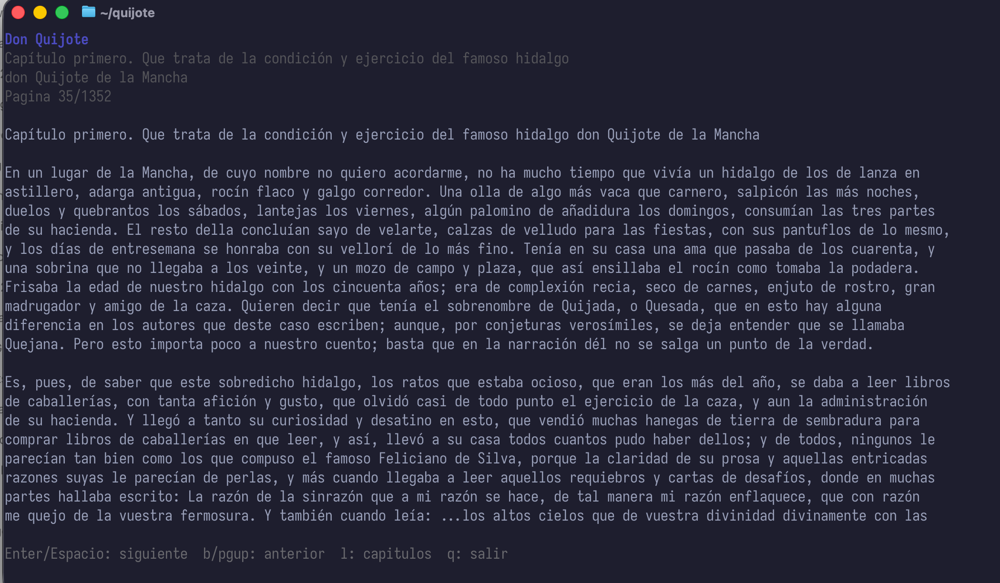

# Quijote

Lector en terminal para "Don Quijote de la Mancha", con interfaz interactiva, busqueda de capitulos y lectura paginada.

Fuente del HTML:
https://www.gutenberg.org/files/2000/2000-h/2000-h.htm




## Requisitos

- Go 1.21+
- Terminal con soporte ANSI

## Uso rapido

```bash
go run .
```

## Compilacion local

```bash
CGO_ENABLED=0 go build -ldflags="-s -w" -o quijote .
```

## Instalacion (binarios)

1) Descarga el binario desde Releases:
   https://github.com/javiermolinar/Quijote/releases
2) Dale permisos de ejecucion (macOS/Linux):

```bash
chmod +x quijote-<tu-sistema>
```

3) Ejecuta:

```bash
./quijote-<tu-sistema>
```

## Comandos

```bash
quijote             (interfaz interactiva)
quijote ui
quijote list
quijote read [-n paginas]
quijote status
quijote goto <numero-capitulo>
quijote reset
```

## Controles en la interfaz

- Enter/Espacio: siguiente pagina
- b/pgup: pagina anterior
- l: lista de capitulos
- q: salir

## Progreso

El progreso se guarda en el archivo `.quijote_state.json` en el directorio del proyecto.

## Notas

- La lista de capitulos es interactiva y permite buscar escribiendo.
- El texto se adapta al tamano del terminal con minimos de ancho/alto.

## Releases (GitHub)

Este repo incluye GoReleaser y un workflow de GitHub Actions para generar binarios:

1) Etiqueta una version y subela:

```bash
git tag v0.1.0
git push origin v0.1.0
```

2) El workflow creara un Release con binarios para:
   - darwin/arm64
   - darwin/amd64
   - linux/amd64
   - windows/amd64
